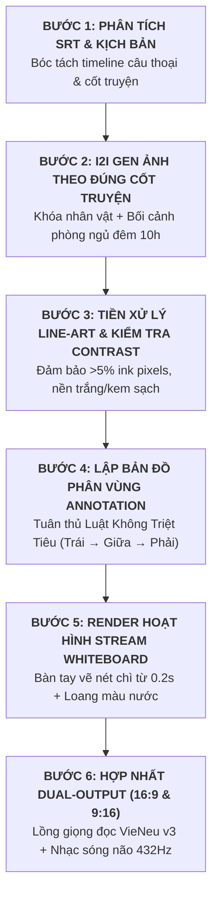

# ✍️ SRT WHITEBOARD & WATERCOLOR ANIMATION ENGINE (v2.1.0 MASTER EDITION)
## ĐỘNG CƠ HOẠT HÌNH VẼ TAY BẢNG TRẮNG & MÀU NƯỚC THEO NỘI DUNG / ẢNH ĐẦU VÀO

> **Tổng quan:** Chuyển đổi phụ đề SRT và **Ảnh Gốc Đầu Vào (Reference Input)** thành video hoạt hình vẽ tay bảng trắng kết hợp tranh màu nước nghệ thuật (`Watercolor Illustration`).  
> **Nâng cấp cốt lõi v2.1.0:**
> 1. **Khảo chứng nội dung ảnh theo cốt truyện (Storyline Congruence):** Bắt buộc bối cảnh và hành động trong ảnh phải ăn khớp 100% với kịch bản (không dùng ảnh chân dung tĩnh ngẫu nhiên).
> 2. **Luật phân vùng không triệt tiêu (Non-Overlapping Partitioning Law):** Ngăn chặn 100% lỗi Mask Zero-Out khi phân vùng sau bao trùm phân vùng trước.
> 3. **Chuẩn tương phản Line-Art (Line-Art Contrast Engine):** Tự động phát hiện và chuyển hóa nét vẽ sắc nét, bảo đảm nét vẽ xuất hiện ngay từ giây đầu tiên ($startMs \le 200ms$).
> 4. **Hệ thống xuất bản kép Dual-Output:** Đồng thời xuất video 16:9 Full HD và 9:16 Shorts/TikTok/Reels.

---

## 🎨 §1. QUY CHUẨN SINH ẢNH I2I & KHẢO CHỨNG NỘI DUNG (CONTENT & STORYLINE CONGRUENCE)

### 1. Khảo chứng nội dung theo cốt truyện (Story-Aligned Scene Generation):
* **Bắt buộc đồng bộ kịch bản (Mandatory Context Alignment):** Ảnh minh họa không được là ảnh chân dung tĩnh tạo ngẫu nhiên. Ảnh BẮT BUỘC phải thể hiện chính xác:
  * **Thời gian & Không gian:** Ví dụ: Phòng ngủ đêm khuya, đồng hồ điểm đúng 10:00 PM, ánh đèn ngủ đầu giường màu vàng dịu ấm áp.
  * **Hành động & Cảm xúc nhân vật:** Mẹ đang ôm ấp, vuốt ve vỗ về bé gái trên giường ngủ dưới tấm chăn ấm; ánh mắt trao trọn sự dịu dàng, an tâm và bình yên.
* **Cơ chế khóa nhân vật (Character-Lock via Reference):**
  * Nạp ảnh mẫu nhân vật gốc (`Reference Images`): Ví dụ: Mẹ (tóc bob ngắn hiện đại cá tính) và Bé (khuôn mặt tròn đáng yêu, má lúm đồng tiền).
  * Giữ nguyên 100% đặc điểm nhận diện nhân vật qua mọi phân cảnh.

### 2. Tiêu chuẩn Phong cách Visual Màu Nước (Visual Guidelines):
* **Nền giấy (Canvas Background):** Nền giấy màu be ấm có vân texture (`Warm Creamy Textured Paper`, mã màu `#F5EBD7`), độ sáng đồng đều.
* **Nét vẽ (Outline):** Nét chì phác thảo mềm mại hoặc nét mực mảnh (`delicate pencil sketch & fine ink contours`) làm khung cho các chi tiết chính, độ tương phản rõ ràng so với nền.
* **Màu sắc (Coloring):** Loang màu nước trong trẻo (`soft translucent watercolor washes, wet-on-dry texture`), màu sắc nhã nhặn, có khoảng loang tự nhiên và vùng chừa sáng (negative white space).
* **Cấm kỵ (Negative Constraints):** Không chèn chữ/text thô vào ảnh nguồn (text do phụ đề/animation đảm nhiệm), không hiệu ứng 3D CGI nhựa bóng, không chi tiết rác gây rối mắt khi vẽ.

---

## 📐 §2. QUY CHUẨN PHÂN VÙNG ANNOTATION & THAM SỐ VẼ TAY (ANNOTATION & RENDERING LAWS)

### 1. Luật Phân Vùng Không Triệt Tiêu (Non-Overlapping Partitioning Law) — BẮT BUỘC:
> [!CRITICAL] **NGUYÊN TẮC BẤT KHẢ XÂM PHẠM:**
> Thuật toán `_allowed_mask` trong `render_stream_whiteboard.py` hoạt động theo cơ chế trừ vùng của các element sau:
> $$\text{mask}_{\text{current}} = \text{region}_{\text{current}} \setminus \bigcup \text{region}_{\text{later}}$$
> Do đó: **TUYỆT ĐỐI KHÔNG** khai báo một phân vùng sau có kích thước bao trùm toàn bộ (`0, 0, width, height`) lên các phân vùng trước, vì điều này sẽ làm **triệt tiêu toàn bộ pixel (zero out)** của các phân vùng trước, dẫn đến việc bàn tay không vẽ gì trong suốt phần lớn thời lượng video!

* **Quy chuẩn phân chia phân vùng:**
  * Chia canvas thành các cột không gian độc lập: **Phân vùng Trái $\rightarrow$ Phân vùng Giữa $\rightarrow$ Phân vùng Phải**.
  * Hoặc phân chia theo các đối tượng riêng biệt (Bounding Boxes) không giao thoa nhau: **Bối cảnh / Đèn ngủ $\rightarrow$ Nhân vật Mẹ $\rightarrow$ Nhân vật Bé**.

### 2. Quy chuẩn Độ tương phản Nét vẽ & Tiền xử lý Line-Art:
* Ảnh đưa vào renderer phải có ít nhất **5% – 10% Ink Pixels** (nét đen/tối) phân bố đều trong từng vùng.
* Nếu ảnh màu nước có nền xám/tối mờ làm giảm độ tương phản của thuật toán `adaptiveThreshold`, BẮT BUỘC chạy qua bộ lọc **`make_lineart.py`** (Gaussian difference pencil sketch) để tạo bản Line-Art trắng đen sắc nét trước khi render.

### 3. Bảng Tham Số Kỹ Thuật Chuẩn:

| Hạng mục | Quy chuẩn mặc định | Ghi chú |
|---|---|---|
| **Thời điểm bắt đầu vẽ** | $startMs \le 200\text{ms}$ | Bắt đầu vẽ ngay lập tức từ giây đầu tiên. |
| **Nền Canvas** | Nền giấy be vân hạt ấm `#F5EBD7` | Lấy mẫu màu từ 4 góc ảnh nguồn. |
| **Quy trình vẽ** | **Nét chì/mực phác thảo (`ink`)** $\rightarrow$ **Loang màu nước (`color fill`)** | Tỷ lệ thời lượng `ink : color = 2 : 1`. |
| **Đường dẫn nét vẽ** | `--ink-path grid` hoặc `--ink-path skeleton` | `grid` cho bố cục mượt mà; `skeleton` bám theo đường viền. |
| **Kiểu quét màu** | `--color-fill contour-wipe` hoặc `--color-fill brush` | Quét loang màu theo đường bao tự nhiên. |
| **Con trỏ tay vẽ** | [`assets/drawing-hand.png`](file:///C:/Users/user/.gemini/config/skills/srt-whiteboard-animation/assets/drawing-hand.png) | Bàn tay cầm bút sạch, góc cọ thực tế. |
| **FPS & Kích thước** | 30 FPS, Long-edge 1080px | Đảm bảo mượt mà và tối ưu thời gian render. |

---

## 🚀 §3. QUY TRÌNH THỰC THI CHUẨN 6 BƯỚC (END-TO-END PIPELINE)



### Chi tiết từng bước:
1. **Bước 1 - Phân tích phụ đề SRT & Cốt truyện:** Xác định bối cảnh cụ thể (thời gian, địa điểm, tâm trạng) và thời lượng chính xác từng câu.
2. **Bước 2 - Tạo ảnh Watercolor đúng cốt truyện:** Dùng I2I kết hợp Prompt mô tả chi tiết bối cảnh phòng ngủ đêm, đồng hồ 10h, mẹ ôm bé vỗ về để tạo ra tác phẩm tranh màu nước hoàn chỉnh.
3. **Bước 3 - Tiền xử lý Line-Art & Tương phản:** Chạy `make_lineart.py` để trích xuất lớp nét chì rõ nét, đảm bảo máy nhận diện được đường vẽ ngay lập tức.
4. **Bước 4 - Lập Annotation JSON:** Ghi nhận 3 phân vùng không gian độc lập không chồng lấn, gán `startMs` bắt đầu từ 200ms.
5. **Bước 5 - Render video hoạt hình vẽ tay:** Chạy `render_stream_whiteboard.py` để bàn tay vẽ liên tục từng nét mực và loang màu nước mềm mại.
6. **Bước 6 - Hợp nhất Dual-Output:** Dùng FFmpeg kết xuất cả bản 16:9 Full HD và 9:16 Shorts (với blur background nghệ thuật + giọng đọc VieNeu-TTS v3 + BGM 432Hz ambient).

---

## 📁 §4. QUY ƯỚC CẤU TRÚC THƯ MỤC DỰ ÁN

```text
C:\Users\user\Downloads\Parenting\<Tên_Dự_Án>\
  ├── voice_bedtime_vieneu_v3.mp3             # Giọng đọc VieNeu v3 Turbo (Thuần Việt)
  ├── voice_bedtime_vieneu_v3.srt             # Phụ đề SRT khớp nhịp
  ├── bgm_432hz_ambient.mp3                   # Nhạc nền sóng não 432Hz thư giãn
  ├── bedtime_mom_kid_scene.jpg               # Tranh màu nước gốc đúng cốt truyện
  ├── bedtime_mom_kid_lineart.jpg             # Bản Line-Art tương phản cao
  ├── scene-01.annotation.json                # Bản đồ phân vùng không triệt tiêu
  ├── whiteboard_raw.mp4                      # Video hoạt hình vẽ tay thô
  ├── Short_Bedtime_VieNeu_Final_16x9.mp4     # Video Master 16:9 Full HD
  └── Short_Bedtime_VieNeu_Final_9x16.mp4      # Video Master 9:16 Shorts / Reels
```

---

## 🛠️ §5. BỘ LỆNH CLI QUY PHẠM

1. **Sinh giọng đọc VieNeu v3 & SRT:**
   ```bash
   python -c "from vieneu_engine_v3_0_0 import VieNeuEngineV3; engine = VieNeuEngineV3(device='cuda'); engine.synthesize(...)"
   ```
2. **Tạo bản Line-Art tương phản cao:**
   ```bash
   python make_lineart.py
   ```
3. **Render hoạt hình vẽ tay:**
   ```bash
   python scripts/render_stream_whiteboard.py <anh_lineart.jpg> <annotation.json> <output_raw.mp4> assets/drawing-hand.png --fps 30 --cap-long-edge 1080 --total-ms 34000
   ```
4. **Hợp nhất Dual-Output (16:9 & 9:16 Shorts):**
   ```bash
   # 16:9 Landscape:
   ffmpeg -y -i <video_raw.mp4> -i <voice.mp3> -i <bgm.mp3> -filter_complex "[1:a]volume=1.0[v];[2:a]volume=0.22[b];[v][b]amix=inputs=2:duration=first[a]" -map 0:v -map "[a]" -c:v libx264 -crf 18 output_16x9.mp4

   # 9:16 Shorts:
   ffmpeg -y -i <video_raw.mp4> -i <voice.mp3> -i <bgm.mp3> -filter_complex "[0:v]scale=1080:1920:force_original_aspect_ratio=increase,crop=1080:1920,gblur=sigma=25[bg];[0:v]scale=1080:-2[fg];[bg][fg]overlay=(W-w)/2:(H-h)/2[vout];[1:a]volume=1.0[v];[2:a]volume=0.22[b];[v][b]amix=inputs=2:duration=first[aout]" -map "[vout]" -map "[aout]" -c:v libx264 -crf 18 output_9x16.mp4
   ```

---

## ✅ §6. TIÊU CHUẨN KIỂM ĐỊNH CHẤT LƯỢNG (QA AUDIT CHECKLIST)

* [ ] **Khảo chứng cốt truyện:** Hình ảnh phản ánh đúng bối cảnh kịch bản (phòng ngủ đêm 10h, mẹ ôm vỗ về bé, đồng hồ, ánh đèn ngủ vàng dịu).
* [ ] **Nhất quán nhân vật:** Gương mặt và mái tóc mẹ (tóc bob ngắn) & bé (má lúm) chuẩn xác theo reference images.
* [ ] **Bắt đầu vẽ tức thì:** Nét vẽ bắt đầu xuất hiện ngay từ giây đầu tiên ($startMs \le 0.2\text{s}$), không bị đơ hoặc trễ vô cớ.
* [ ] **Luật không triệt tiêu mask:** Kiểm tra pixel đếm trong từng phân vùng $\ge 150.000\text{ pixels}$, không có phân vùng nào bị 0 pixel.
* [ ] **Độ mượt mà chuyển động:** Bàn tay cầm bút `drawing-hand.png` lướt êm ái, nét vẽ hiện đều đặn và loang màu nước hài hòa.
* [ ] **Chất lượng âm thanh:** Giọng đọc VieNeu v3 biểu cảm, rõ ràng, hòa quyện với nhạc nền 432Hz êm dịu, không bị lấn át giọng đọc.
